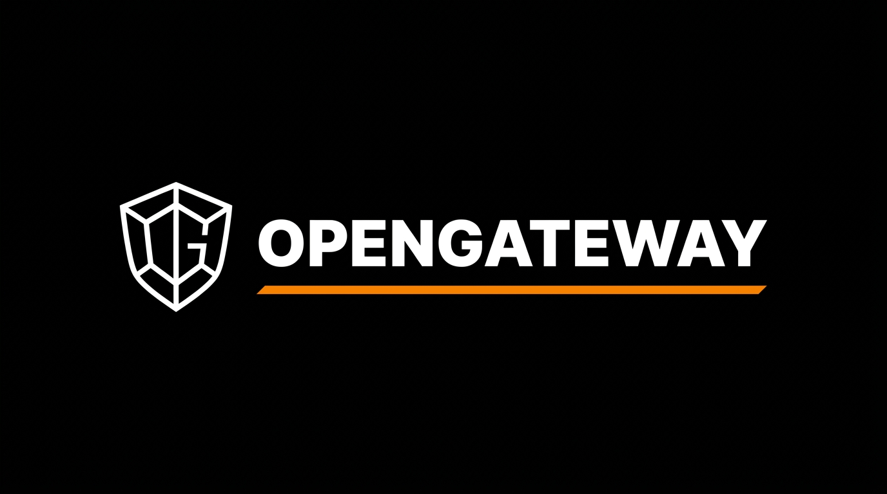

<div align="center">



**The fastest way to add SSO, audit logs, guardrails, and routing to any AI app.**

OpenAI-compatible. Every feature free. MIT, forever.

[Docs](docs/architecture.md) · [Quick Start](#quick-start) · [Drop-in Replacement](#drop-in-replacement) · [Providers](#providers) · [ADRs](adr/)

|         |                                                                                                                                                                                                                                                                                                                                                                                                                                                                                                                                                                                                                                                                                                                                      |
| ------- | ------------------------------------------------------------------------------------------------------------------------------------------------------------------------------------------------------------------------------------------------------------------------------------------------------------------------------------------------------------------------------------------------------------------------------------------------------------------------------------------------------------------------------------------------------------------------------------------------------------------------------------------------------------------------------------------------------------------------------------ |
| CI/CD   | [](https://github.com/echohello-dev/opengateway/actions) [](https://github.com/echohello-dev/opengateway/actions) |
| Docs    | [](https://docs.opengateway.dev) |
| Package | [](LICENSE) |
| Meta    | [](https://python.org) [](https://www.modular.com/mojo) [](https://github.com/echohello-dev/opengateway/stargazers) |

</div>

---

## Why this exists

Every AI gateway on the market takes the same bet: **lock the good stuff behind an enterprise license**.

| | Open source | SSO | Audit logs | Guardrails | Advanced routing | License |
|---|---|---|---|---|---|---|
| **LiteLLM** | MIT | ❌ | ❌ | basic | basic | Commercial for the rest |
| **Bifrost** | Apache 2.0 | ❌ | ❌ | ❌ | basic | Enterprise for the rest |
| **Portkey** | AGPL | ✅ | ✅ | ✅ | ✅ | Source-available |
| **OpenGateway** | MIT | ✅ | ✅ | ✅ | ✅ | MIT forever |

LiteLLM charges for SSO and audit logs. Bifrost gates guardrails and clustering behind enterprise. **OpenGateway gives you everything in the OSS build**, funded by managed hosting and support, the same model Red Hat used with Backstage.

> "Bifrost is Go. OpenGateway is Python/Mojo, easier to customise." internal positioning line.

And unlike every other Python AI gateway, OpenGateway ships a **second server on Mojo + [flare](https://github.com/ehsanmok/flare)** for when you want a single static binary at the edge.

---

## Quick Start

### Python (default)

```bash
$ uv pip install -e ".[dev]"
$ cp .env.example .env && $EDITOR .env   # set ROOT_KEY and OPENAI_API_KEY
$ opengateway
INFO:     Uvicorn running on http://0.0.0.0:8080
```

### Mojo (flare), static binary

```bash
$ curl -fsSL https://pixi.sh/install.sh | sh     # one-time
$ pixi install -e mojo
$ pixi run -e mojo mojo run opengateway/mojo/main.mojo
opengateway (mojo): listening on 0.0.0.0:8080 with 4 workers
```

Both servers implement the same `POST /v1/chat/completions` endpoint and share the same provider adapters. Switch via deployment shape, not via code.

### Hit it

```bash
$ curl -s http://localhost:8080/health
{"status":"ok"}

$ curl -s -X POST http://localhost:8080/v1/chat/completions \
    -H "Authorization: Bearer $ROOT_KEY" \
    -H "Content-Type: application/json" \
    -d '{
      "model": "gpt-4o-mini",
      "messages": [{"role": "user", "content": "Say hi in five languages"}]
    }' | jq '.choices[0].message.content'
"Hello, Hola, Bonjour, Hallo, こんにちは"
```

---

## Drop-in Replacement

Point any OpenAI-compatible client at OpenGateway with one line. Same API, same SDK, no code changes.

```diff
# Python (openai SDK)
- client = OpenAI(api_key="sk-...")
+ client = OpenAI(base_url="http://localhost:8080/v1", api_key="sk-og-...")

# TypeScript (openai SDK)
- const client = new OpenAI({ apiKey: "sk-..." })
+ const client = new OpenAI({ baseURL: "http://localhost:8080/v1", apiKey: "sk-og-..." })

# curl
- curl https://api.openai.com/v1/chat/completions ...
+ curl http://localhost:8080/v1/chat/completions ...
```

Every OpenAI SDK works without modification. Anthropic, Google GenAI, LiteLLM, and LangChain SDKs work the same way through the provider router.

---

## Features

### Core Infrastructure

- **OpenAI-compatible endpoint.** Same request shape, same response shape, same error format. Drop-in for every OpenAI client SDK.
- **Multi-provider support.** OpenAI, Anthropic, AWS Bedrock, Google Vertex, Azure, and more, behind a single API.
- **Automatic fallbacks.** Seamless failover between providers and models with zero downtime.
- **Load balancing.** Intelligent request distribution across multiple API keys and providers.
- **Streaming (SSE).** Server-sent events work out of the box, same wire format as OpenAI.

### Governance and Security

- **Virtual keys with model allow-lists.** Per-key permissions restrict which models each caller can hit.
- **Per-key budgets and rate limits.** Token-bucket rate limiting and USD budget caps per virtual key.
- **Audit logs.** Structured events for every request, queryable by key, model, and time range.
- **SSO / SAML.** OIDC and SAML authentication for admin interfaces and key management.
- **RBAC.** Team, organisation, and admin role hierarchy.
- **IP ACLs.** Restrict access to specific source IPs or CIDR ranges.
- **Custom branding.** Logo, colours, and per-tenant theming on the admin UI.

### Observability

- **Native Prometheus metrics.** Request counts, latency histograms, error rates, token usage.
- **Distributed tracing.** OpenTelemetry-compatible export to Jaeger, Tempo, or Honeycomb.
- **Structured request logging.** JSON logs with key, model, latency, tokens, and cost.

### Developer Experience

- **Zero-config startup.** Single command, single binary, no database required to start.
- **Single static binary** (Mojo path) for serverless, edge, and Lambda deployments.
- **Conventional commits** drive automated versioning and changelog generation via release-please.
- **Standard formats everywhere.** OpenAPI for the spec, JSON for the config, dotenv for the env.

---

## Providers

| Provider | Status | Routing prefixes | Key env var |
|---|---|---|---|
| **OpenAI** | shipped | `gpt-*`, `openai/*` | `OPENAI_API_KEY` |
| **Anthropic** | routed, adapter pending | `claude-*`, `anthropic/*` | `ANTHROPIC_API_KEY` |
| **AWS Bedrock** | routed, adapter pending | `bedrock/*`, `amazon.*` | _(AWS credentials)_ |
| **Azure OpenAI** | planned | `azure/*` | `AZURE_OPENAI_API_KEY` |
| **Google Vertex** | planned | `vertex/*` | _(GCP credentials)_ |
| **vLLM / local** | planned | `local/*` | _(none)_ |

[Adding a provider](docs/architecture.md#adding-a-provider) takes three steps: implement `BaseProvider`, add a routing rule, configure the key.

---

## Integrations

OpenGateway is a drop-in replacement for any OpenAI-compatible client. Tested with:

| SDK | Status | Notes |
|---|---|---|
| [openai-python](https://github.com/openai/openai-python) | works | Set `base_url` to the gateway URL |
| [openai-node](https://github.com/openai/openai-node) | works | Set `baseURL` to the gateway URL |
| [anthropic-sdk-python](https://github.com/anthropics/anthropic-sdk-python) | works | Via provider router |
| [Google GenAI](https://github.com/google-gemini/generative-ai-python) | works | Via provider router |
| [LiteLLM SDK](https://github.com/BerriAI/litellm) | works | Nested routing for migration |
| [LangChain](https://github.com/langchain-ai/langchain) | works | Use OpenAI-compatible endpoint |

---

## Configuration

Everything is environment variables or `.env`:

| Variable | Default | Description |
|---|---|---|
| `ROOT_KEY` | `sk-root-change-me` | Admin key with full access. **Replace before deploying.** |
| `OPENAI_API_KEY` | _(unset)_ | Upstream key for `gpt-*` and `openai/*`. |
| `ANTHROPIC_API_KEY` | _(unset)_ | Upstream key for `claude-*` and `anthropic/*`. |
| `DATABASE_URL` | `postgresql://...` | Tenants, keys, audit logs. |
| `REDIS_URL` | `redis://...` | Rate limits and short-lived caches. |
| `HOST` | `0.0.0.0` | Bind address. |
| `PORT` | `8080` | Bind port. |
| `WORKERS` | `1` | uvicorn workers (Python only). |
| `DEBUG` | `false` | Reload on file changes. |
| `LOG_LEVEL` | `INFO` | `DEBUG` / `INFO` / `WARNING` / `ERROR`. |
| `REQUIRE_AUTH` | `true` | Reject requests without a valid `Authorization` header. |

API keys follow [`sk-og-{token}`](adr/001-api-key-format.md), the same prefix shape as OpenAI, branded to OpenGateway.

---

## Architecture

```
   OpenAI-compatible client
            │
            ▼
   ┌────────────────────┐
   │  HTTP API surface  │   ← FastAPI (Python, default)
   │                    │     OR flare  (Mojo,    opt-in)
   └─────────┬──────────┘
             │
             ▼
   ┌────────────────────┐
   │  PythonObject      │   ← only in the Mojo path
   │  bridge            │
   └─────────┬──────────┘
             │
            ═╪═  single sync function call, returns envelope
            ═╪═
             │
             ▼
   ┌────────────────────┐
   │  Python business   │   ← auth, validation, provider dispatch
   │  logic             │
   └─────────┬──────────┘
             │
             ▼
   ┌────────────────────┐
   │  Provider adapters │   ← opengateway/providers/{openai,anthropic,bedrock,...}.py
   └─────────┬──────────┘
             │
             ▼
   ┌────────────────────┐
   │  Upstream LLM API  │   ← OpenAI / Anthropic / Bedrock / ...
   └────────────────────┘
```

**FastAPI** is the default. Python ecosystem, 700+ contributors, mature, boring.

**Mojo on flare** is for when you need a single static binary at the edge: sub-50 ms cold start, ~30 MB image, no `pip install` in your container.

They share the same provider adapters, the same auth, the same config. The Mojo to PythonObject boundary is one synchronous function call (`handle_chat`) that returns an envelope dict so the Mojo handler never catches Python exceptions.

Full layout in [docs/architecture.md](docs/architecture.md) and the rationale in [ADR-002](adr/002-mojo-api-surface.md).

---

## Repository Structure

```
opengateway/
├── opengateway/
│   ├── main.py              # FastAPI server (default)
│   ├── auth.py              # Virtual key + root key auth
│   ├── config.py            # Settings via pydantic-settings
│   ├── keys.py              # API key generator (sk-og-{token})
│   ├── router.py            # Model-to-provider routing
│   ├── providers/           # Provider adapters
│   │   ├── base.py
│   │   └── openai.py
│   ├── mojo/                # Mojo server on flare
│   │   ├── main.mojo
│   │   ├── router.mojo
│   │   └── bridge.mojo
│   └── mojo_bridge/         # Python side of the Mojo bridge
│       ├── auth.py
│       └── chat.py
├── tests/
│   ├── test_proxy.py        # FastAPI server tests
│   └── test_mojo_bridge.py  # Bridge tests
├── docs/                    # Documentation
│   ├── architecture.md
│   ├── release-process.md
│   └── assets/              # Banner image and other assets
├── adr/                     # Architecture Decision Records
├── pyproject.toml           # Python package config
├── pixi.toml                # Mojo environment config
├── Dockerfile               # Container build
└── docker-compose.yml       # Local dev stack (Postgres + Redis + gateway)
```

---

## Philosophy

A few principles we hold ourselves to. They're non-negotiable.

1. **Every feature ships in the OSS build.** SSO, audit logs, guardrails, advanced routing. None of them are paywalled. The code is the product.
2. **OpenAI-compatible is the API contract.** Not "compatible-ish". Not "subset". The same request shape, the same response shape, the same error format.
3. **Boring tech where it matters.** FastAPI, Postgres, Redis, Pydantic. We don't get bonus points for picking weird.
4. **New tech where it pays off.** Mojo for the binary-deploy path. Conventional commits for release automation. Standard formats everywhere else.
5. **Tests in CI, not in promises.** 23 Python tests today, more every week. No `// TODO: test this later` in main.
6. **The README is a contract.** If it doesn't run as written, the docs are wrong, not the code.

---

## Roadmap

Shipped today:

- [x] OpenAI-compatible `/v1/chat/completions`
- [x] Virtual keys with model allow-lists
- [x] Per-key budgets
- [x] OpenAI provider adapter
- [x] Dual server: FastAPI + Mojo on flare
- [x] release-please to PyPI publishing
- [x] Drop-in replacement for openai-python, openai-node, and Anthropic SDKs

Next up:

- [ ] **Anthropic provider** adapter plus Bedrock pass-through
- [ ] **PostgreSQL-backed virtual keys** (currently in-memory)
- [ ] **Streaming SSE in the Mojo server**
- [ ] **Guardrails**: PII detection, prompt injection, content moderation
- [ ] **Audit log**: structured events, queryable
- [ ] **SSO**: OIDC + SAML
- [ ] **Rate limits**: token-bucket per key, Redis-backed
- [ ] **Adaptive routing**: score-based provider selection
- [ ] **Native Prometheus metrics** endpoint

Long term:

- [ ] Managed SaaS, the Phase 3 from the strategy note
- [ ] Enterprise support contracts, the Phase 4 from the strategy note

---

## Documentation

| Doc | What it covers |
|---|---|
| [docs/architecture.md](docs/architecture.md) | Runtime layout, dual-server design, Mojo to Python boundary |
| [docs/release-process.md](docs/release-process.md) | release-please flow, conventional commits, PyPI trusted publisher |
| [docs/mojo-python-ai-gateway.md](docs/mojo-python-ai-gateway.md) | Original design sketch (historical rationale) |
| [adr/001-api-key-format.md](adr/001-api-key-format.md) | The `sk-og-{token}` key format |
| [adr/002-mojo-api-surface.md](adr/002-mojo-api-surface.md) | Why Mojo for the API surface |
| [CONTRIBUTING.md](CONTRIBUTING.md) | Dev setup, commit conventions, PR process |

---

## Contributing

We accept contributions under [DCO](./CONTRIBUTING.md). Commits follow [Conventional Commits](https://www.conventionalcommits.org/). `release-please` uses your commit messages to drive the version bump and the changelog, so prefix your commits with `feat:`, `fix:`, `docs:`, etc.

```bash
# Set up
git clone https://github.com/echohello-dev/opengateway.git
cd opengateway
uv pip install -e ".[dev]"

# Run everything
make test           # pytest
make lint           # ruff + mypy
make format         # ruff format
make mojo-test      # Mojo router tests (requires pixi)

# Open a PR with a clear title and description
```

---

## Project Status

**Alpha (0.x).** The core proxy works end-to-end with the OpenAI provider. Anthropic and Bedrock adapters are routed but not yet implemented. Virtual keys and budgets are scaffolded. DB-backed persistence is the next milestone. Expect breaking changes before 1.0.

Watch [releases](https://github.com/echohello-dev/opengateway/releases) for tagged versions, and check the [open issues](https://github.com/echohello-dev/opengateway/issues) for the current roadmap.

---

## Star History

<a href="https://star-history.com/#echohello-dev/opengateway&Date">
  <picture>
    <source media="(prefers-color-scheme: dark)" srcset="https://api.star-history.com/svg?repos=echohello-dev/opengateway&type=Date&theme=dark" />
    <source media="(prefers-color-scheme: light)" srcset="https://api.star-history.com/svg?repos=echohello-dev/opengateway&type=Date" />
    
  </picture>
</a>

---

## License

[MIT](./LICENSE). The whole thing, forever. No telemetry, no callbacks, no surprise license change in 1.0.

<div align="center">

Made with 🐍 Python and 🔥 Mojo. Hosted on coffee.

</div>
